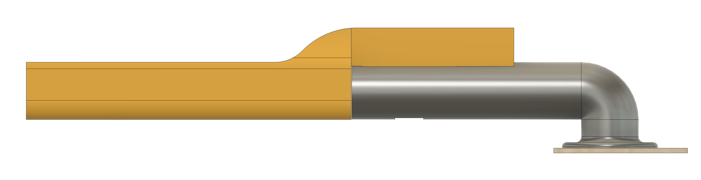
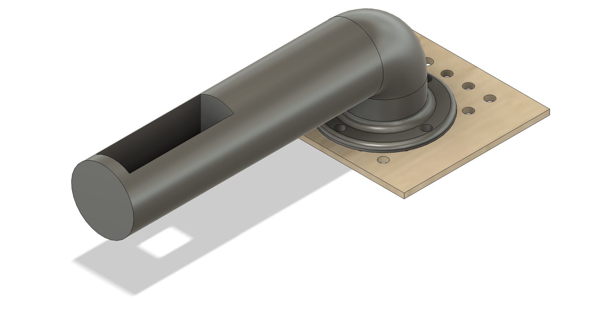

# 148-spring-2025-final-project-team-10
INSERT IMAGE OF THE CAR HERE

# Team Members
- Efe Erturk: BS in Computer Engineering 
- Etka Uzun: BS in Aerospace Engineering
- Jason Junran: BS in Computer Engineering
- Pushkal Mishra: PhD in ???
  
# Abstract

# Goals

## Must Have

## Nice to Have

# Accomplishments

# Challenges

# Demo Video

# Hardware

## Wiring

## Parts

| Part | CAD Model |
|------|-----------|
| **Electronics Mounting Plate** |  [CAD File](cad/ElectronicsPlate.f3d) |
| **NVIDIA Jetson Nano Case** |  [CAD File](cad/CameraMount.step) |

- Traxxas 1/10 Ford Fiesta® ST Rally
- Mounting board
  
- NVIDIA Jetson Nano Case
  
- GPS Mount
  
- Oak-d Lite Camera Mount
  
  
- ESP32 Mount
  
  
  - Arm
    
  - Extension
    
- ESP32 Case
  
- Power Bank & ESP32 Case
  

# Software

# How to Run (Step by Step)

# Acknowledgements

# Contacts
- Efe Erturk (eerturk@ucsd.edu)
- Etka Uzun (muzun@ucsd.edu)
- Jason Junran (juw070@ucsd.edu)
- Pushkal Mishra (pumishra@ucsd.edu)
