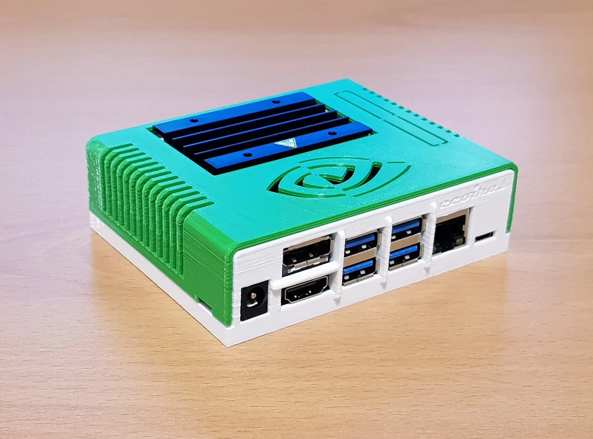
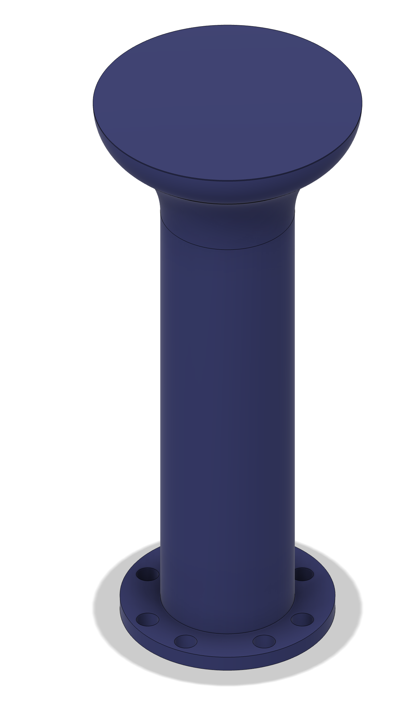
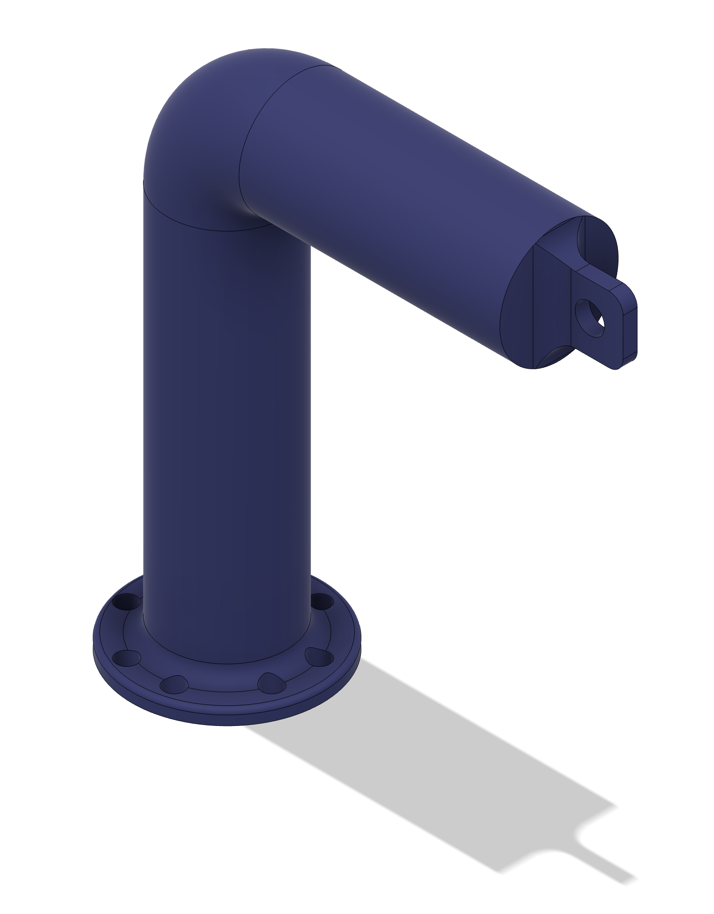
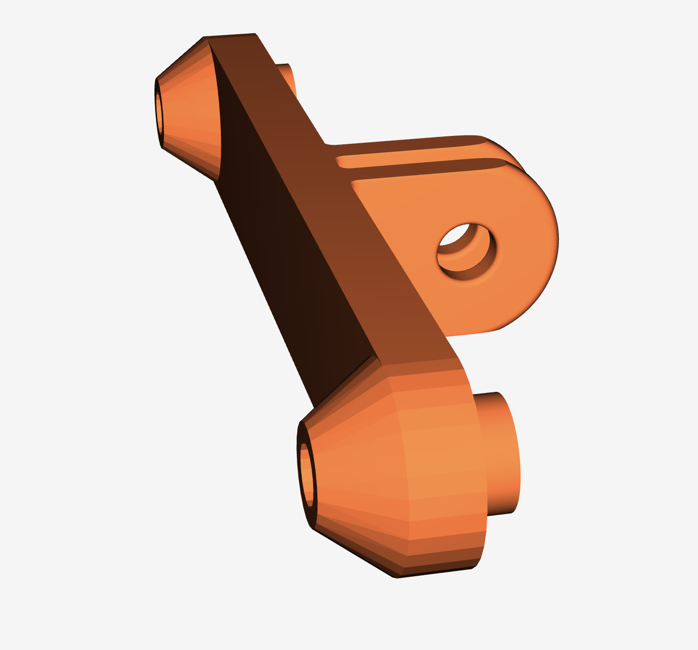
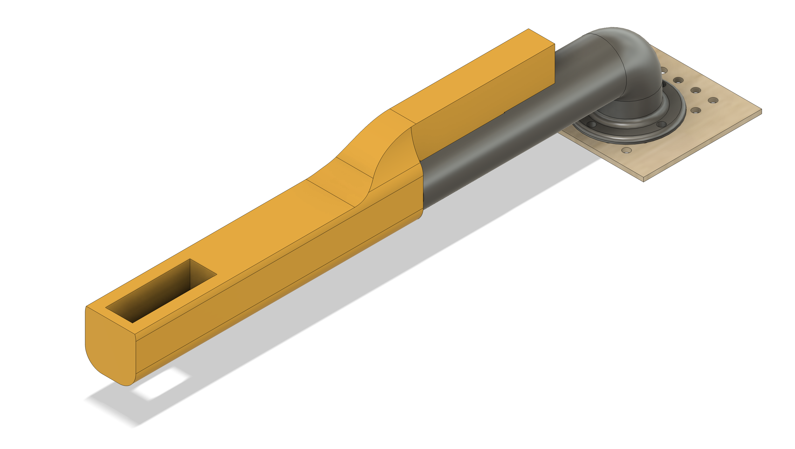
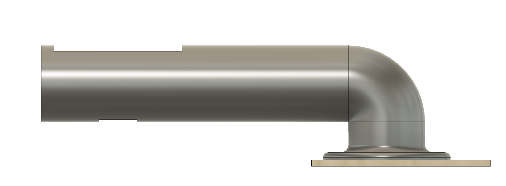
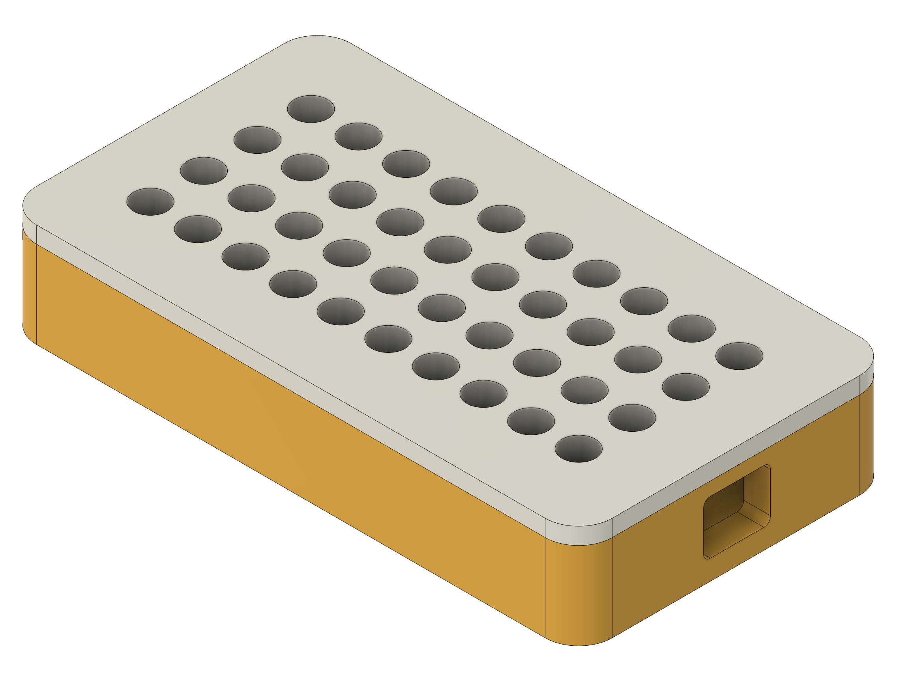
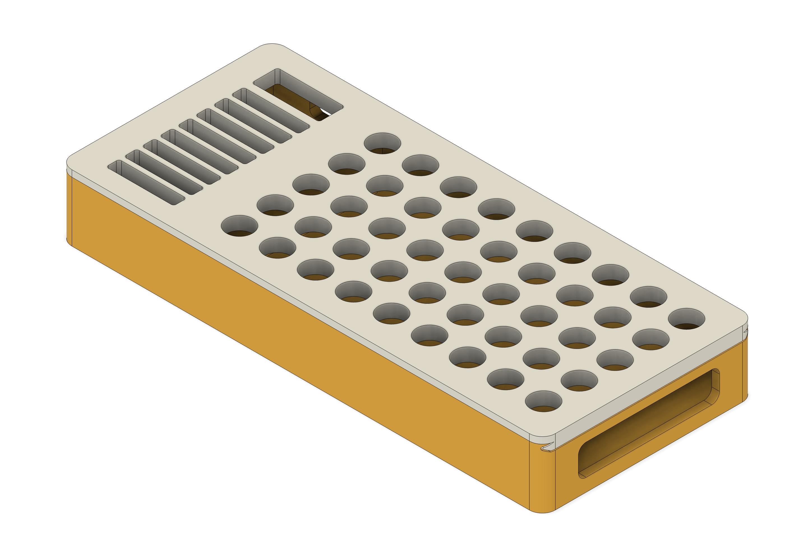

# 148-spring-2025-final-project-team-10
INSERT IMAGE OF THE CAR HERE

  
Table of Contents

  - [Team Members](#team-members)
  - [Abstract](#abstract)
  - [Goals](#goals)
    - [Must Have](#must-have)
    - [Nice to Have](#nice-to-have)
  - [Accomplishments](#accomplishments)
  - [Challenges](#challenges)
  - [Demo Video](#demo-video)
  - [Hardware](#hardware)
    - [Wiring](#wiring)
    - [Parts](#parts)
  - [Software](#software)
  - [How to Run (Step by Step)](#how-to-run-step-by-step)
  - [Acknowledgements](#acknowledgements)
  - [Contacts](#contacts)

## Team Members
- **Efe Erturk**: BS in Computer Engineering 
- **Etka Uzun**: BS in Aerospace Engineering
- **Jason Junran**: BS in Computer Engineering
- **Pushkal Mishra**: PhD in ???
  
## Abstract

## Goals

### Must Have

### Nice to Have

## Accomplishments

## Challenges

## Demo Video

## Hardware

### Wiring

### Parts

| Part | Preview  |  File |
|------|--------------------------|----------|
| **Mounting Board** |  | [DXF](models/Electronics%20Mount%20Plate%20v1.dxf) |
| **NVIDIA Jetson Nano Case** |  | [Bottom STL](models/NanoBox_Bottom_v21.stl) • [Top STL](models/NanoBox_Top_v22.stl) |
| **GPS Mount** |  | [STL](models/gps_mount.stl) |
| **Oak-D Lite Camera Mount** |   | [STL](models/camera_mount.stl) |
| **ESP32 Mount** |  | |
| **ESP32 Mount – Arm** |  | [STL](models/arm.stl) |
| **ESP32 Mount – Extension** |  | [STL](models/extension.stl) |
| **ESP32 Case** |  | [STL](models/esp_case_2.stl) |
| **Power-Bank & ESP32 Case** |  | [Bottom STL](models/power_bank_case_1.stl) • [Top STL](models/power_bank_case_2.stl) |

## Software

## How to Run (Step by Step)

## Acknowledgements

## Contacts
- Efe Erturk (eerturk@ucsd.edu)
- Etka Uzun (muzun@ucsd.edu)
- Jason Junran (juw070@ucsd.edu)
- Pushkal Mishra (pumishra@ucsd.edu)
