# Autonomous Driving with Ultra-Wide Band (UWB) and Aruco Marker

<div align="center">
  <a href="https://jacobsschool.ucsd.edu/">
    
  </a>
  <h3>ECE/MAE-148 Final Project</h3>
  <p>
    Spring 2025 - Team 10
  </p>
  <a>
    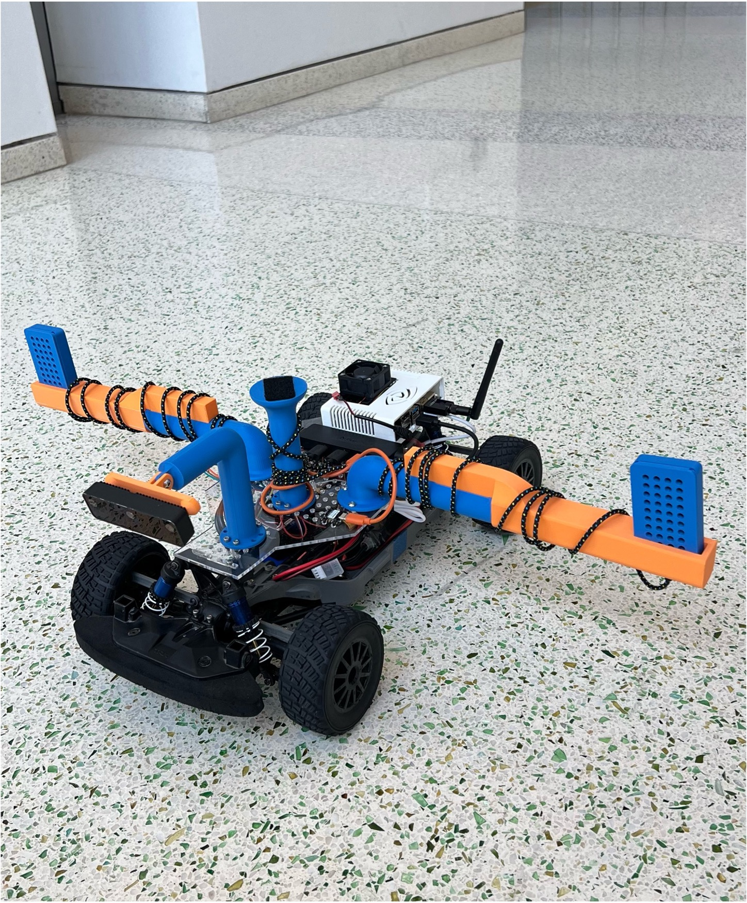
    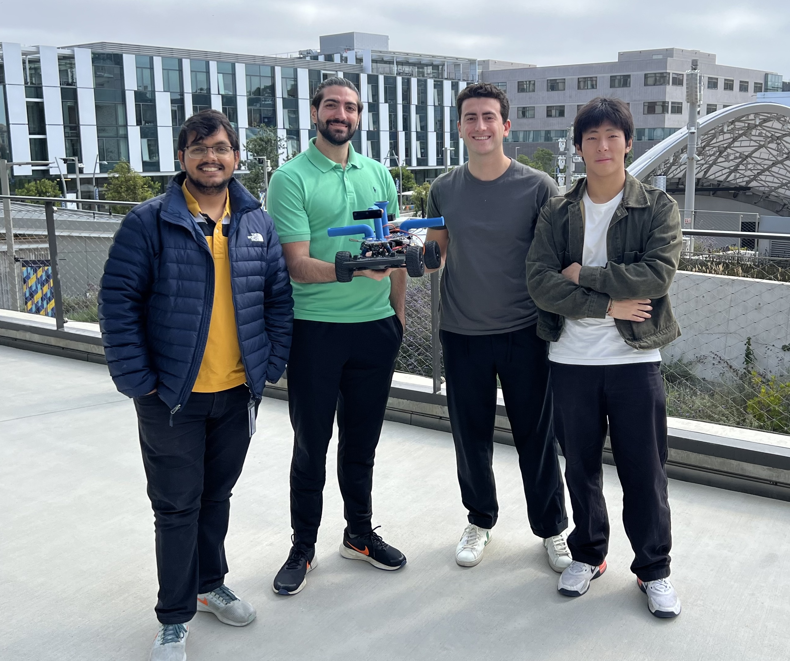

  </a>
</div>

<details>
  <summary>Table of Contents</summary>

  - [Team Members](#team-members)
  - [Abstract](#abstract)
  - [Goals](#goals)
    - [Must Have](#must-have)
    - [Nice to Have](#nice-to-have)
  - [Accomplishments](#accomplishments)
  - [Challenges Faced](#challenges-faced)
  - [Step-by-Step Running Instructions](#step-by-step-running-instructions)
    - [Hardware Setup](#hardware-setup)
    - [Software Setup](#software-setup)
    - [Plotting Live Location from ESP32](#plotting-live-location-from-esp32)
    - [Driving the Car with ESP32](#driving-the-car-with-esp32)
    - [Driving the Car with Aruco Marker](#driving-the-car-with-aruco-marker)
  - [Code Documentation](#code-documentation)
    - [Driving with ESP32](#driving-with-esp32)
    - [Driving with Aruco Marker](#driving-with-aruco-marker)
  - [Hardware Used](#hardware-used)
    - [Parts](#parts)
    - [Wiring](#wiring)
  - [Gantt Chart](#gantt-chart)
  - [Acknowledgements](#acknowledgements)
  - [Contacts](#contacts)

  </details>


## Team Members
- **Efe Erturk** | ECE: BS in Electrical Engineering 
- **Etka Uzun** | MAE: BS in Aerospace Engineering
- **Junran "Jason" Wang** | ECE: BS in Computer Engineering
- **Pushkal Mishra** | ECE: PhD in Wireless Sensing and ML
  
## Abstract
In this project, we developed an autonomous car following system using Ultra-Wide Band (UWB) technology and Aruco markers. The system is designed to enable a car to autonomously follow a UWB-enabled ESP32 tag and identify the tag with an Aruco marker. Additionally, the car can also follow the aruco marker once it is in the field-of-view. The project integrates various hardware components: NVIDIA Jetson Nano, OAK-D Lite camera, 3 ESP32 microcontroller with UWB support and IMU sensor, to achieve real-time distance measurement and control.

The aim of the project is to detect an ESP32 tag and autonomously drive towards it using triangulation and Aruco marker detection. The car is equipped with a camera for visual recognition and two ESP32 tags for UWB communication. The system is designed to be robust, allowing the car to follow the tag even in complex environments with non line-of-sight.

## Goals
### Must Have
- Accurate position measurement using triangulation with UWB.
- IMU sensor for orientation data.
- Aruco marker detection for visual identification and driving.
- Autonomous driving towards the detected tag.

### Nice to Have
- Integrate both ESP32 and Aruco marker detection for robust following.
- Real-time following of the tag.
- LiDAR integration for obstacle avoidance.

## Accomplishments
- Successfully implemented UWB triangulation for accurate distance measurement.

https://github.com/user-attachments/assets/99eae474-88a1-4db3-a036-837bd43ad0e0

In this video, we are plotting the location of the ESP32 tag predicted in real-time using the UWB triangulation. The car is placed on a desk and the tag is continuously moved around the environment and the location of the tag is plotted in real-time from the jetson connected to a monitor. In the plot, you can see two red dots representing the tags on the car and the blue dot representing the predicted location of the tag. The car is able to accurately predict the location of the tag even when it is moved around.

- IMU sensor integration for orientation data to correct for yaw of the car.

https://github.com/user-attachments/assets/ff7656d6-d6ba-4912-a2eb-ccfd36a7f4ab

In this video, we are demonstrating the robustness of location prediction using sensor fusion with IMU and UWB triangulation. The car is placed on a stand and the tag is kept stationary. As the car is rotated around, the predicted location of the tag remains stable, demonstrating the robustness of measured angular deviation using the IMU sensor. This is crucial for accurate navigation as we need to calculate the angle that the car has rotated to accurately predict the location of the tag. 

- Car can autonomously drive to a UWB-enabled ESP32 tag even in non line-of-sight condition.

https://github.com/user-attachments/assets/731a74e7-a74d-4a91-b878-ca56320b25f8

In this video, the car autonomously detects, generates waypoints and drives towards the ESP32 tag kept on the ground. This is a line-of-sight condition where there are no obstacles in the way between the car and the tag, and the car can safely drive towards the tag. 

https://github.com/user-attachments/assets/dc13d5db-3512-4963-a193-890831c27531

In this video also the car detects the tag and drives towards it. However, this is a non line-of-sight condition where there is an obstacle in between the car and the tag, and the car generates curved waypoints around the obstacle to reach the tag.

- Aruco marker detection implemented for visual identification.

https://github.com/user-attachments/assets/7d87b73c-9c4e-48f1-9f4e-f30a59d7324a

In this video, the car detects an Aruco marker, reads the ID of the marker to confirm weather its a valid user to track, determines the location and orientation of the marker and correspoindingly drive towards the marker. The steering and rotation of the car is controlled in real-time to ensure that the car is always facing the marker and is at-least 30cm away from the marker. Also the car is able to follow the marker even when it is moving around. 

## Challenges Faced
- We were limited by low range (~15m) and sometimes we wouldn't get position data due to small antenna of the DW3000 chip. 
- Even though our individual parts worked well, our location estimation varied a lot due to added uncertanities from all of them.
- We faced issues in integrating the transition from driving with ESP32 localization and driving with Aruco marker in the donkeycar framework.
- When following the Aruco marker, ROS2 was very laggy, we faced this issue in our lane-following assignment also. Might need to use an updated Jetson or larger SD card.

## Step-by-Step Running Instructions
### Hardware Setup
- Use the provided 3D-printed parts to mount the NVIDIA Jetson Nano, OAK-D Lite camera, ESP32 tags, and IMU sensor on the car.
- Connect the two ESP32 tags, OAK-D Lite Camera, and IMU sensor to the Jetson using cables.
- Ensure that the ESP32 tags are securely mounted and connected to Jetson.
- Connect the dongle for the controller to the Jetson Nano.

### Software Setup:
- First you need to install Arduino CLI, DW3000 library and IMU on the jetson nano. This can be found in the links: [Arduino CLI](https://arduino.github.io/arduino-cli/0.35/installation/), [DW3000 Library](https://github.com/Makerfabs/Makerfabs-ESP32-UWB-DW3000) and [IMU Library](https://wiki.seeedstudio.com/XIAO_BLE/)
- Clone this repository to your local machine:
  ```bash
  git clone https://github.com/UCSD-ECEMAE-148/148-spring-2025-final-project-team-10.git
  ```
- To write the localization code to the ESP32, you can open each of the `.ino` code in `driving-with-esp32/esp32_code` directory using Arduino IDE and upload it to the ESP32 tags. To use the more reliable localization, follow the instructions [here](https://github.com/kk9six/dw3000) to upload the code present in `driving-with-esp32/esp32_code_v2` directory.
- To write the code to IMU, you can simly run the following command in Jetson's terminal:
  ```bash
  cd ./driving-with-esp32/IMUcode/
  bash compile_imu.sh
  ```
- Since we are replacing the GPS coordinates with ESP32 coordinates, we need to replace the `vehicle.py` file in the donkeycar framework with the one present in `driving-with-esp32/vehicle.py`. Use the following command to do so:
  ```bash
  cp ./driving-with-esp32/vehicle.py /home/jetson/projects/donkeycar/donkeycar/vehicle.py
  ```
### Plotting Live Location from ESP32:
- As seen in the video above, we can plot the live location of the ESP32 tag using the code present in `driving-with-esp32/location_tag.py`. 
- To run this code, use the following command:
  ```bash
  cd ./driving-with-esp32/
  python3 location_tag.py
  ```
- Make sure that the thrid ESP32 anchor is connected to a power bank.
### Driving the Car with ESP32:
- To drive the car using ESP32 triangulation, you can simply run the GPS code. Run the following command in the Jetson Terminal:
  ```bash
  cd ./driving-with-esp32/
  python3 manage.py drive
  ```
- Steps to run the car:
  - First, press the "B" button to reset the IMU readings.
  - Then, press "Y" to generate the waypoints to the ESP32 tag.
  - Then, press "X" to load the path.
  - Finally press the "Start" button to start driving the car towards the ESP32 tag.
- The above key mappings can be found in `driving-with-esp32/myconfig.py`.

### Driving the Car with Aruco Marker:
> **TODO**: Jason please add the steps: Pulling the container, copying over the code, running ROS2 using bash script.
> Step 1: Pull the Robocar Docker Image
```bash
docker pull djnighti/ucsd_robocar:devel
```
🖥️ Step 2: Enable X11 Forwarding

This allows ROS2 nodes that rely on GUI output (like image windows) to display properly.

On your host machine:
```bash
ssh -X jetson@<jetson_ip_address>
```
On the Jetson (do once):
```bash
sudo usermod -aG docker ${USER}
su - ${USER}
```
Now test X11:
```bash
xeyes  # If googly eyes appear, you're good!
```
Optional: You may need to run this if facing issues:
```bash
sudo apt-get install --reinstall xserver-xorg
sudo chmod 777 .Xauthority
```
Step 3: Update Docker Daemon (NVIDIA Runtime Support)
```bash
sudo rm /etc/docker/daemon.json
sudo nano /etc/docker/daemon.json
```
Paste:
```bash
{
  "runtimes": {
    "nvidia": {
      "path": "nvidia-container-runtime",
      "runtimeArgs": []
    }
  },
  "default-runtime": "nvidia"
}
```
Then:
```bash
sudo reboot now
```
Step 4: Add robocar_docker Function
```bash
gedit ~/.bashrc
```
Append this function:
```bash
robocar_docker () {
  docker run \
    --name ${1} \
    -it \
    --privileged \
    --net=host \
    -e DISPLAY=$DISPLAY \
    -v /dev/bus/usb:/dev/bus/usb \
    --device-cgroup-rule='c 189:* rmw' \
    --device /dev/video0 \
    --volume="$HOME/.Xauthority:/root/.Xauthority:rw" \
    djnighti/ucsd_robocar:${2:-devel}
}
```
Apply changes:
```bash
source ~/.bashrc
```
Now launch Docker container:

robocar_docker test_container

In new terminals:
```bash
docker start test_container
docker exec -it test_container bash
```
Step 5: Create ROS2 Package for Aruco

Inside the container:
```bash
cd ~/ros2_ws/src
ros2 pkg create --build-type ament_python aruco_marker --dependencies rclpy sensor_msgs geometry_msgs std_msgs
```
Then clone your Python node scripts:
```bash
cd aruco_marker
mkdir aruco_marker
cd aruco_marker
# Add your Python scripts here and clone the vesc_submodule:
git clone <oakd_aruco_node.py_url> oakd_aruco_node.py
git clone <vesc_twist_node.py_url> esc_twist_node.py
git clone <vesc_submodule_repo_url> vesc_submodule
```
Update setup.py:
```bash
setup(
    name=package_name,
    version='0.0.0',
    packages=[package_name, f'{package_name}.vesc_submodule'],
    data_files=[
        ('share/' + package_name, ['package.xml']),
        ('share/' + package_name + '/launch', glob('launch/*.launch.py')),
    ],
    install_requires=['setuptools'],
    zip_safe=True,
    maintainer='yourname',
    maintainer_email='your@email.com',
    description='ArUco detection and VESC control node',
    license='TODO',
    tests_require=['pytest'],
    entry_points={
        'console_scripts': [
            'oakd_aruco_node = aruco_marker.oakd_aruco_node:main',
            'vesc_twist_node = aruco_marker.vesc_twist_node:main'
        ],
    },
)
```
Add __init__.py files in both aruco_marker/ and any submodules.

Step 6: Create Launch File

Create launch/duo_node.launch.py:
```bash
from launch import LaunchDescription
from launch_ros.actions import Node

def generate_launch_description():
    return LaunchDescription([
        Node(
            package='aruco_marker',
            executable='oakd_aruco_node',
            name='oakd_tracker',
            output='screen'
        ),
        Node(
            package='aruco_marker',
            executable='vesc_twist_node',
            name='vesc_controller',
            output='screen'
        )
    ])
```
Step 7: Build, Source, and Launch

From inside Docker:
```bash
source_ros2
cd ~/ros2_ws
colcon build
source install/setup.bash
ros2 launch aruco_marker duo_node_.launch.py
```
Step 8 (Optional but recommend): Create a bash script for easy source, build, and launch

Create a bash script
```bash
touch run_ros2.sh
```

Content in the bash script
```bash
#!/bin/bash
source install/setup.bash
colcon build --packages-select aruco_marker
source install/setup.bash
ros2 launch aruco_marker duo_nodes.launch.py
```

Step 9: use run_ros2 inside ros2_ws/src/aruco_marker/aruco_marker

```bash
bash run_ros2.sh
```
You should now see both the Aruco detection and the VESC command node running simultaneously.

## Code Documentation
### Driving with ESP32
The directory `driving-with-esp32` contains all the code needed to drive the car. This part of the project is divided into three parts:
1. **ESP32 Distancing**: 
  - Before we can get to estimating coordinates of the tag, we first need to measure distance between two tags. 
  - Below image shows the parameters and timing measurements we need to take care of while measuring distance:
    <div align="center">
      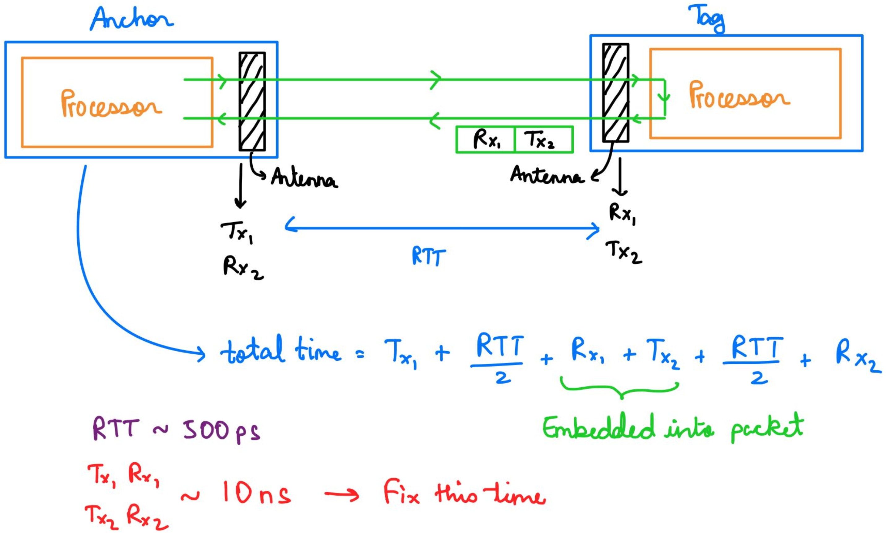
    </div>
  - In the above image, the anchor sends a packet to the tag, which then sends a response back to the anchor. 
  - The anchor measures the time taken for the round trip and calculates the distance using the speed of light.

2. **Communication between ESP32**: 
  - For determining position of the tag, we need two tags on the car which calls for developing a communication protocol between the two ESP32 tags. 
  - The protocol is summarized in the below image:
    <div align="center">
      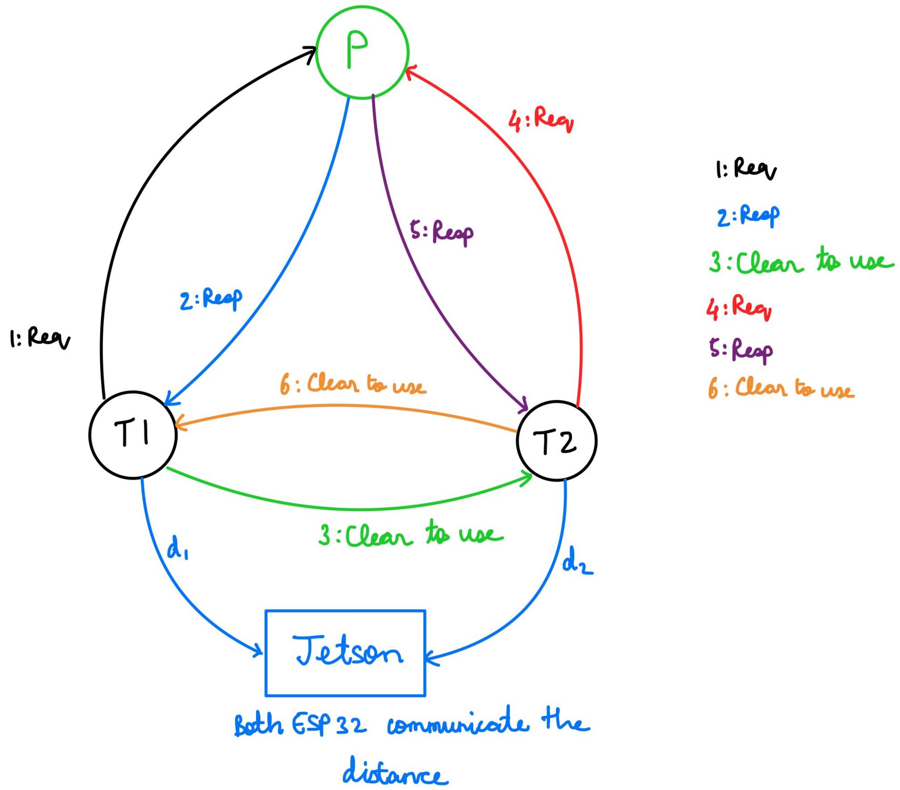
    </div>
  - This can be summarized as follows:
    - First the tag T1 sends a request packet for distancing to the anchor P.
    - The anchor P then sends a response packet to T1. T1 measures the time taken for the response and calculates the distance to the anchor.
    - T1 sends a clearance packet to T2, which is the second tag on the car.
    - T2 then sends a request packet to the anchor P.
    - The anchor P then sends a response packet to T2. T2 measures the time taken for the response and calculates the distance to the anchor.
    - T2 then sends a clearance packet to T1, which is the first tag on the car.
  - The code for Part 1 and 2 are written through arduino and can be found in the directory: `driving-with-esp32/esp32_code_v2`.
  - We were facing a lot of issues with the precision of the distance measurements, so we used the code from this repository: [https://github.com/kk9six/dw3000](https://github.com/kk9six/dw3000). We made a few modifications for our setup, which can be found in `driving-with-esp32/`.

3. **ESP32 Triangulation**: 
  - We mounted two ESP32 tags on the car which will measure the distance to a thrid ESP32 anchor placed in the environment. 
  - The image below shows the triangulation algorithm used to determine the coordinates of the tag:
    <div align="center">
      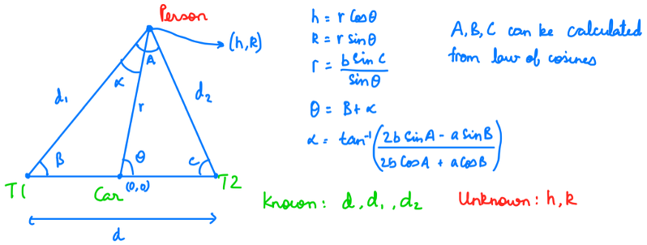
    </div>
  - Using this formula, we can calculate the coordinates of the tag using the distances measured by the two ESP32 tags on the car. 
  - The code for this part is in `driving-with-esp32/location_tag.py`.
    
4. **IMU Integration**:
  - We are using nRF52840 Sense IMU with 6 DOF, which supports acceleration and gyroscope data in x, y, z axes.
  - This figure shows the change in angular acceleration of as the IMU is rotated:
    <div align="center">
      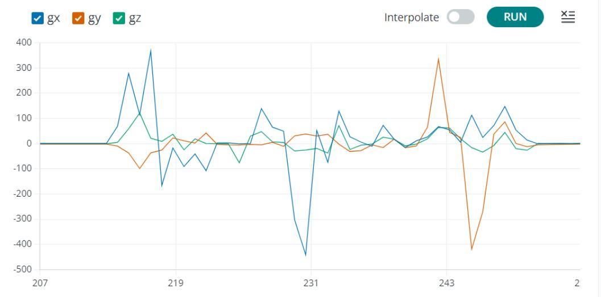
    </div>
  - The Z-axis gyroscope data (gz) is used to estimate the yaw angle (rotation around the vertical axis) by integrating angular velocity over time.
  - The yaw is normalized to a 0–360° range and transmitted to the jetson via serial monitor every 50 ms.
    
5. **ESP32-IMU Fusion**: 
  - As the orientation of the car changes when it drives towards the tag, the reference coordinate for distance and angle measurements also changes. 
  - This effect can be seen in the below image, where the left diagram is the case when the car does not rotate and the right diagram is the case when the car rotates:
    <div align="center">
      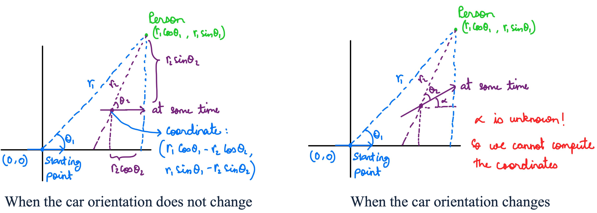
    </div>
  - To cancel out this effect, we used an IMU sensor to compute the yaw of the car and correct the coordinates of the tag accordingly.
  - The code for this part is written through arduino and can be found in the directory: `driving-with-esp32/IMUcode`.

6. **Waypoint Generation**:
  - For the car to drive towards the tag, we need to generate waypoints for the car to follow.
  - We have generated two types of paths, one is linear and the other is a curved path. These can be seen in the below image:
    <div align="center">
      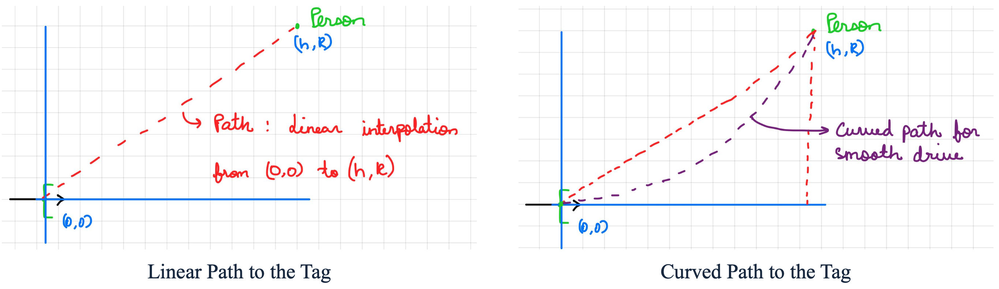
    </div>
  - The curved path is basically a quadratic equation in such a manner that it passes through the tag and the car's initial position. The curvature of this path can be controlled by the parameter `PATH_CURVE_FACTOR` in `driving-with-esp32/myconfig.py`.
  - A higher path curve factor will result in a lesser curvature.

7. **Driving with ESP32**: 
  - Once we have the accurate coordinates of the tag, we used the GPS Donkeycar framework to drive the car towards the tag.
  - First we generate the waypoints for the car to the tag, and then pass this to the GPS Donkeycar framework to drive the car.
  - The code for this part is present in: `driving-with-esp32/manage.py`.
  - Further, we replaced the positions dumped by the GPS with the positions predicted by the ESP32 triangulation algorithm. This part of the code is present in `driving-with-esp32/vehicle.py`. Please note that this code should be put in the `donkeycar` directory of the donkeycar framework.

### Driving with Aruco Marker
> **TODO**: Jason please add a brief explanation of the code: cover how aruco marker detection is done, adding it as a node (add reference to the files in readme), adding the VESC node, computing steering and acceleration, and publisher-subscriber model for both VESC and Aruco nodes.

## Hardware Used
### Parts
| Part | Preview  |  File |
|------|--------------------------|----------|
| **Mounting Board** | 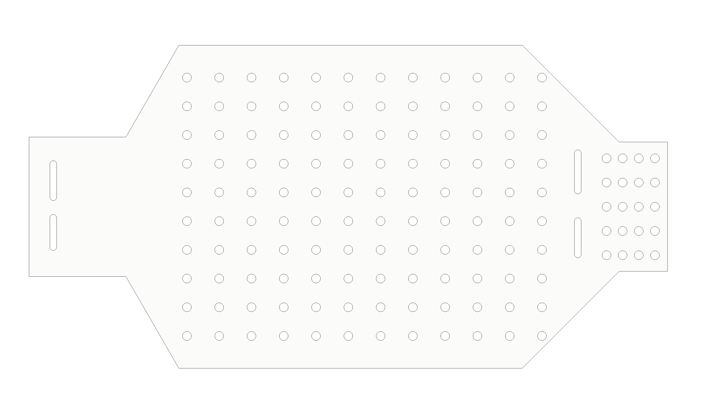 | [DXF](media/stl-files/Electronics%20Mount%20Plate%20v1.dxf) |
| **NVIDIA Jetson Nano Case** |  | [Bottom STL](media/stl-files/NanoBox_Bottom_v21.stl) • [Top STL](media/stl-files/NanoBox_Top_v22.stl) |
| **GPS Mount** |  | [STL](media/stl-files/gps_mount.stl) |
| **Oak-D Lite Camera Mount** | 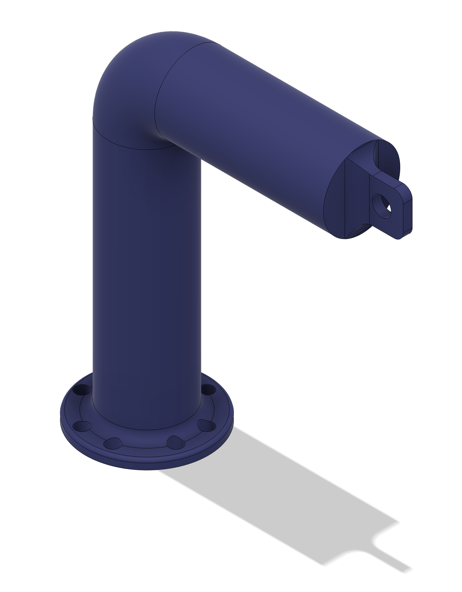<br> | [Mount STL](media/stl-files/camera_mount.stl) • [Adapter 3MF](media/stl-files/OAK-DLiteAdapter.3mf) |
| **ESP32 Mount** |  | |
| **ESP32 Mount – Arm** | 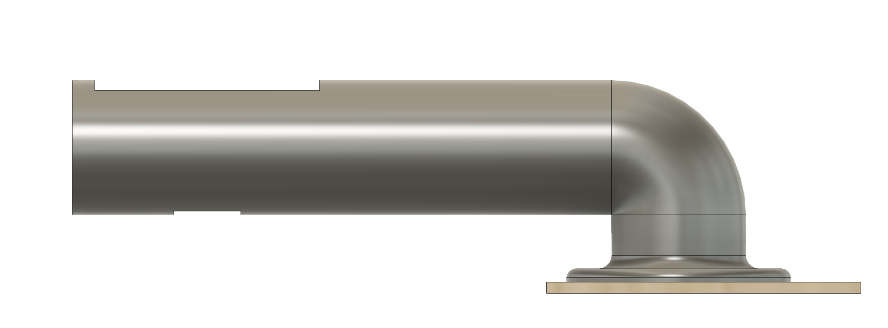 | [STL](media/stl-files/arm.stl) |
| **ESP32 Mount – Extension** | 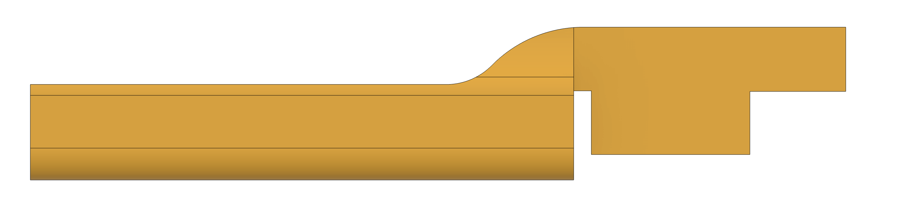 | [STL](media/stl-files/extension.stl) |
| **ESP32 Case** | 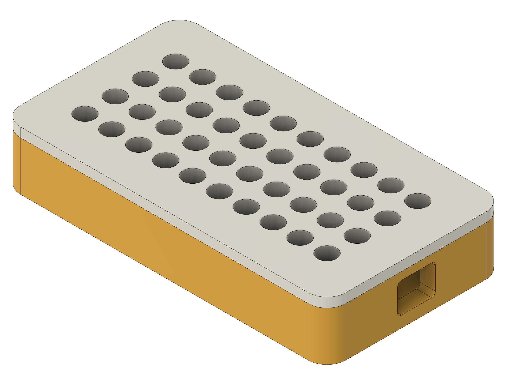 | [STL](media/stl-files/esp_case_2.stl) |
| **Power-Bank & ESP32 Case** | 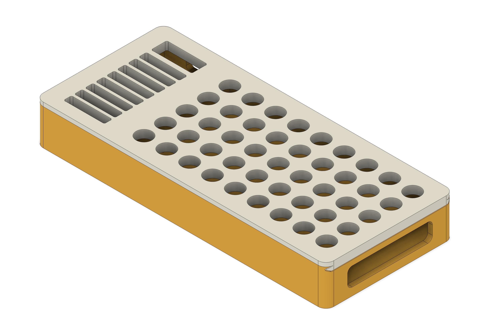 | [Bottom STL](media/stl-files/power_bank_case_1.stl) • [Top STL](media/stl-files/power_bank_case_2.stl) |
| **ESP32 with UWB** | 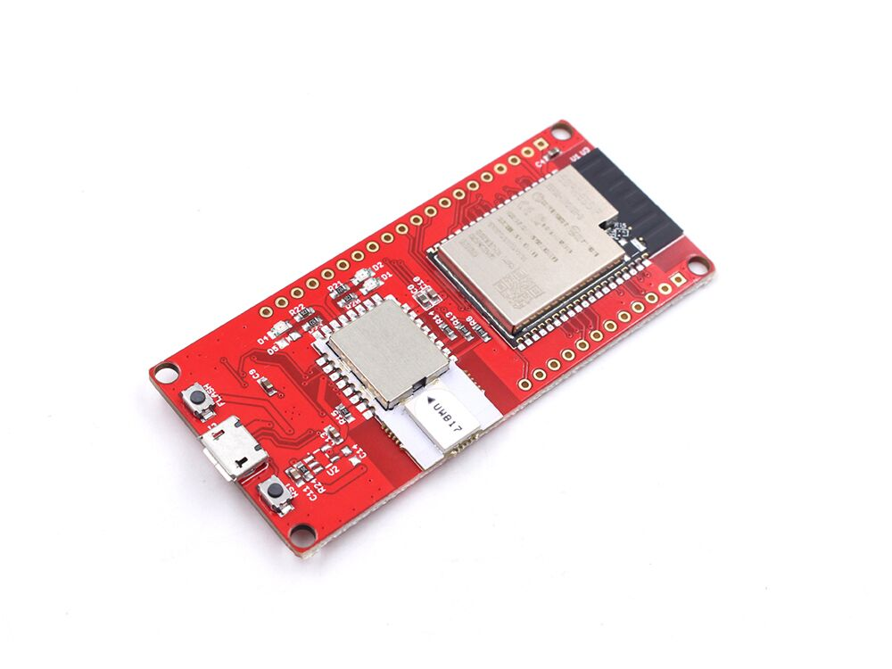 | [Product Link](https://www.makerfabs.com/esp32-uwb-dw3000.html?srsltid=AfmBOorf-qO5e5mbXH0PJVKdmqxx--euOzTTMy_9mlpG27S6Im0cnn02) |
| **OAK-D Camera** | 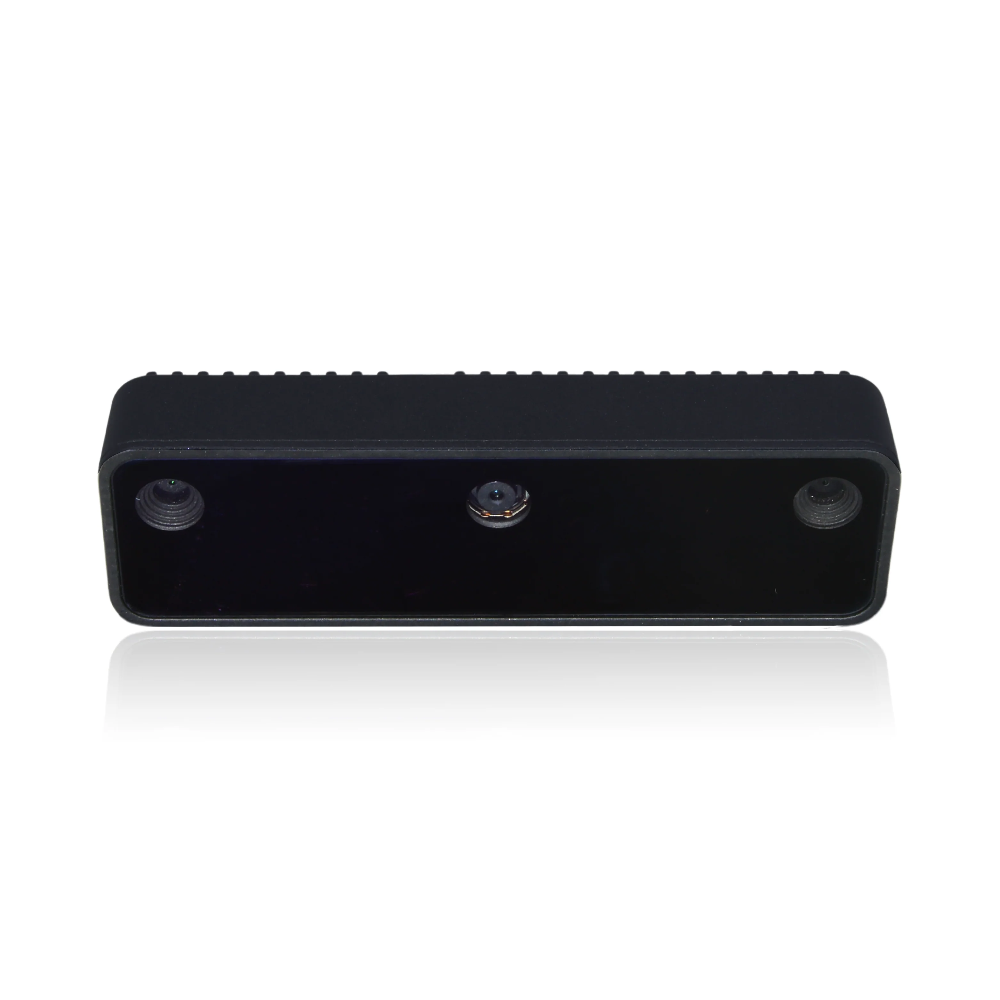 | [Product Link](https://shop.luxonis.com/products/oak-d-lite-1?variant=42583102456031) |
| **IMU** | 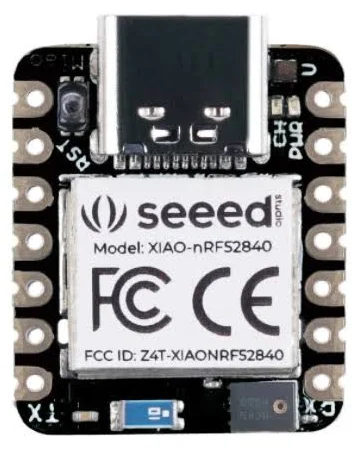 | [Product Link](https://wiki.seeedstudio.com/XIAO_BLE/) |
| **Logitech Controller** |  | [Product Link](https://www.logitechg.com/en-us/products/gamepads/f710-wireless-gamepad.940-000117.html?gclid=Cj0KCQjwz7uRBhDRARIsAFqjulkuKo41BBWfzpkCoHsG_LRd6WOvTYzetC7DRXhKwdPnabcZy49XMJ0aAhT_EALw_wcB) |


### Wiring
<div align="center">
  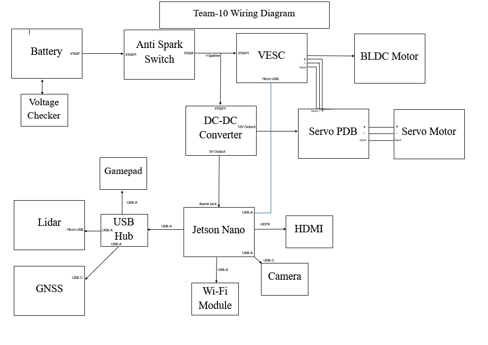
</div>

## Gantt Chart
<div align="center">
  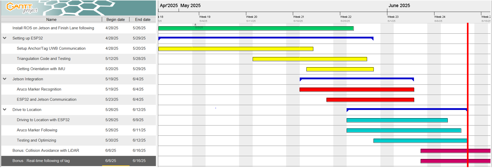
</div>

## Acknowledgements
Special thanks to Professor Jack Silberman and our TAs, Alex and Winston for the continous support and guidance throughout the quarter.

## Contacts
- Pushkal Mishra (pumishra@ucsd.edu)
- Efe Erturk (eerturk@ucsd.edu)
- Jason Junran (juw070@ucsd.edu)
- Etka Uzun (muzun@ucsd.edu)
