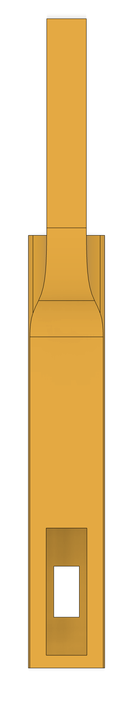

# 148-spring-2025-final-project-team-10
INSERT IMAGE OF THE CAR HERE

# Team Members
- Efe Erturk: BS in Computer Engineering 
- Etka Uzun: BS in Aerospace Engineering
- Jason Junran: BS in Computer Engineering
- Pushkal Mishra: PhD in ???
  
# Abstract

# Goals

## Must Have

## Nice to Have

# Accomplishments

# Challenges

# Demo Video

# Hardware

## Wiring

## Parts

## Mechanical Parts Overview

| Part | Preview  | CAD File |
|------|--------------------------|----------|
| **Mounting Board** |  | [DXF](models/Electronics%20Mount%20Plate%20v1.dxf) |
| **NVIDIA Jetson Nano Case** |  | [Bottom STL](models/NanoBox_Bottom_v21.stl) • [Top STL](models/NanoBox_Top_v22.stl) |
| **GPS Mount** |  | [STL](models/gps_mount.stl) |
| **Oak-D Lite Camera Mount** |   | [STL](models/camera_mount.stl) |
| **ESP32 Mount** |  | |
| **ESP32 Mount – Arm** |  | [STL](models/arm.stl) |
| **ESP32 Mount – Extension** |  | [STL](models/extension.stl) |
| **ESP32 Case** |  | [STL](models/esp_case_2.stl) |
| **Power-Bank & ESP32 Case** |  | [Bottom](models/power_bank_case_1.stl) • [Top](models/power_bank_case_2.stl) |

# Software

# How to Run (Step by Step)

# Acknowledgements

# Contacts
- Efe Erturk (eerturk@ucsd.edu)
- Etka Uzun (muzun@ucsd.edu)
- Jason Junran (juw070@ucsd.edu)
- Pushkal Mishra (pumishra@ucsd.edu)
